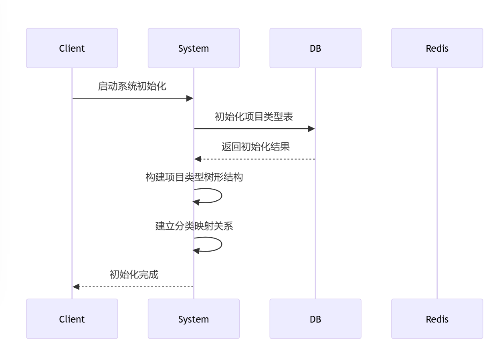
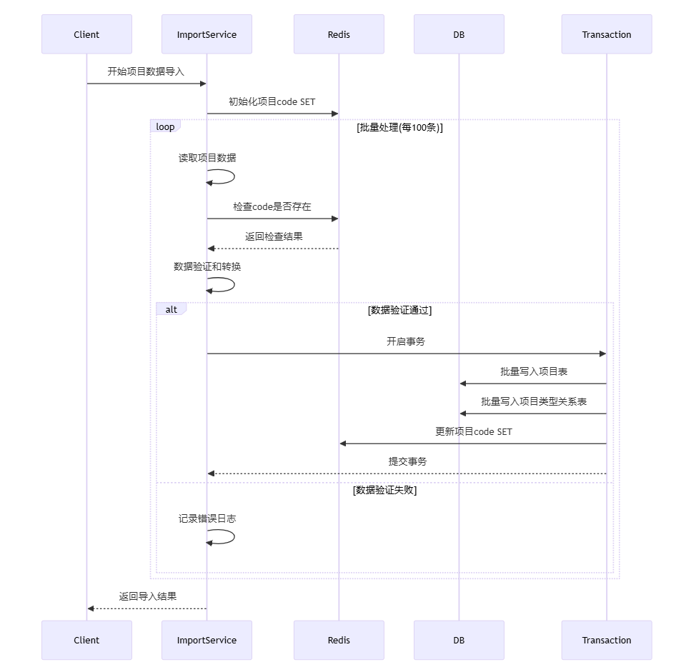
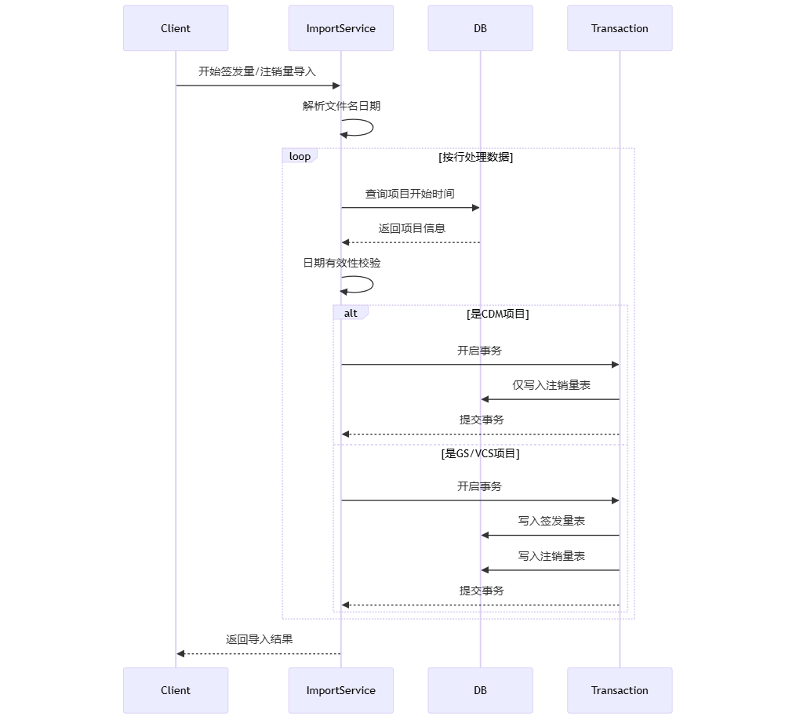

### 导入需求设计
#### 1. 目前有三个项目，CDM,GS VCS, 每个项目存在自己的表结构，原因如下：
1. 并发性能
   - 不同项目类型的数据可以并行导入
   - 减少表级锁的竞争
   - 充分利用Go的goroutine特性

2. 事务管理
   - 每个项目类型的事务互不影响
   - 减少事务冲突概率
   - 缩短单个事务的执行时间

3. 数据管理
   - 便于按项目类型进行数据维护
   - 可以针对不同项目类型制定不同的索引策略
   - 方便进行数据备份和恢复
#### 2. CS,VCS项目， 基本字段是相同的，主要是：编号，方法学，项目名称，项目名称(英文)，国家，国家(英文)，计入开始时间，计入结束时间，计入期
月），年减排量
#### 3. CMD项目： 基本字段是相同的，主要就是多几个个字段：核证减排量，核证减排量发放次数（其实相当于CDM表是不存在何减排量表的，归总到了项目表中）
#### 4. 表设计如下：
```go
// Project 项目模型
type Project struct {
    ID                int64    `gorm:"column:id;primaryKey;type:bigint unsigned" json:"id"`                           // 主键ID
    Code             string       `gorm:"column:code;type:varchar(10);uniqueIndex:udx_project_code" json:"code"`                                              // 编号
    Methodology      string    `gorm:"column:methodology;type:varchar(100)" json:"methodology"`                       // 方法学
    Name             string    `gorm:"column:name;type:varchar(100)" json:"name"`                                     // 项目名称
    NameEn           string    `gorm:"column:name_en;type:varchar(100)" json:"name_en"`                              // 项目名称(英文)
    ProjectTypeEn    string    `gorm:"column:project_type_en;type:varchar(50)" json:"project_type_en"`               // 项目类型(英文)
    Country          string    `gorm:"column:country;type:varchar(50)" json:"country"`                               // 国家
    CountryEn        string    `gorm:"column:country_en;type:varchar(50)" json:"country_en"`                         // 国家(英文)
    StartDate        time.Time `gorm:"column:start_date;type:date" json:"start_date"`                                // 开始时间
    EndDate          time.Time `gorm:"column:end_date;type:date" json:"end_date"`                                    // 结束时间
    IsPoa            bool      `gorm:"column:is_poa;type:bool" json:"is_poa"`                                        // 是否POA项目
    EmissionReductions decimal.Decimal `gorm:"column:emission_reductions;type:decimal(10,2)" json:"emission_reductions"` // 年减排量
    IsFullData       bool      `gorm:"column:is_full_data;type:bool" json:"is_full_data"`                           // 是否是完整数据
    CertifiedEmissionReductions decimal.Decimal `gorm:"column:certified_emission_reductions;type:decimal(10,2)" json:"certified_emission_reductions"` // CMD 项目表 特有字段：核证减排量
    IssuanceCount    int       `gorm:"column:issuance_count;type:int" json:"issuance_count"`                        //  CMD 项目表 特有字段： 核证减排量发放次数
    CreditPeriodType int       `gorm:"column:credit_period_type;type:int" json:"credit_period_type"`                //  CMD 项目表 特有字段：贷记期类型
}

// ProjectType 项目类型表 : 只有基础的一张包含所有项目类型的表
type ProjectType struct {
    ID   int64 `gorm:"column:id;primaryKey;type:bigint unsigned" json:"id"`     // 主键ID
    PID  int64 `gorm:"column:pid;type:bigint unsigned" json:"pid"`             // 父级ID,用于构建类型树形结构,顶级为0
    Name string `gorm:"column:name;type:varchar(50)" json:"name"`               // 类型名称
}

// ProjectTypeRelation 项目-类型关系表  项目和类型（存在一对多关系）
type ProjectTypeRelation struct {
    ID            int64     `gorm:"column:id;primaryKey;type:bigint unsigned" json:"id"`              // 主键ID
    ProjectCode     string     `gorm:"column:project_code;type:varchar(10);index" json:"project_code"`   // 项目Code编号
    ProjectTypeID int64     `gorm:"column:project_type_id;type:bigint unsigned;index" json:"project_type_id"` // 项目类型ID
    CreatedAt     time.Time `gorm:"column:created_at;autoCreateTime" json:"created_at"`               // 创建时间
}

// ProjectCancelled 项目注销量表
type ProjectCancelled struct {
    ID                int64    `gorm:"column:id;primaryKey;type:bigint unsigned" json:"id"`                           // 主键ID
    ProjectCode     string     `gorm:"column:project_code;type:varchar(10);index" json:"project_code"`   // 项目Code编号
    Cancelled         decimal.Decimal `gorm:"column:cancelled;type:decimal(10,2)" json:"cancelled"` // 注销量
    Date              time.Time `gorm:"column:date;type:date" json:"date"`                                            // 日期
}


// ProjectIssued 项目签发表
 type ProjectIssued struct {
    ID                int64    `gorm:"column:id;primaryKey;type:bigint unsigned" json:"id"`                           // 主键ID
    ProjectCode     string     `gorm:"column:project_code;type:varchar(10);index" json:"project_code"`   // 项目Code编号
    Issued            decimal.Decimal `gorm:"column:issued;type:decimal(10,2)" json:"issued"` // 发行量
    Date              time.Time `gorm:"column:date;type:date" json:"date"`                                            // 日期
 }
```
#### 5. UML类图如下：


#### 6. 系统初始化
   - 初始化项目类型表，构建树形结构
   - 建立项目分类映射关系（不规则分类 -> 标准树形结构）
  


#### 7. 项目数据导入流程
1. 数据去重准备
   - 使用Redis SET存储现有项目code
   - SET key设计: "project:codes"
   
2. 批量数据处理
   - 按行读取项目数据
   - 数据验证与转换：
     * 检查必填字段完整性（决定is_full_data状态）
     * 验证code是否在Redis SET中（防重复导入）
     * 转换数据格式（日期、数值等）
   
3. 批量写入控制
   - 设置批次大小（100条/批）
   - 事务处理：
     * 批量写入项目表
     * 批量写入项目类型关系表
     * 更新Redis SET（新增code）




#### 8. 签发量/注销量导入流程
1. 文件处理
   - 解析文件名中的日期信息
   - 验证日期有效性

2. 数据筛选
   - 按行读取数据
   - 日期校验：
     * 比对项目开始时间
     * 过滤无效数据

3. 差异化处理
   - 普通项目（GS/VCS）：
     * 写入签发量表
     * 写入注销量表
   - CDM项目：
     * 仅写入注销量表
     * 签发量直接存储在项目表中
    
    

#### 9. 注意事项
1. 数据一致性
   - 使用事务确保批量写入的原子性
   - Redis SET与数据库的同步维护

2. 性能优化
   - 批量处理减少数据库压力
   - Redis缓存提高查询效率

3. 异常处理
   - 数据格式异常处理
   - 事务回滚机制
   - 导入失败恢复机制
#### 10 如果项目进行整合不在单独显示，则可以进行连表查询或者创建视图
```sql
// 创建视图sql如下
CREATE VIEW v_all_projects AS
-- CDM项目
SELECT 
    CONCAT('CDM_', id) as unified_id,
    id as original_id,
    code,
    methodology,
    name,
    name_en,
    project_type_en,
    country,
    country_en,
    start_date,
    end_date,
    is_poa,
    emission_reductions,
    is_full_data,
    certified_emission_reductions,
    issuance_count,
    credit_period_type,
    'CDM' as project_source,
    created_at,
    updated_at
FROM cdm_projects

UNION ALL

-- GS项目
SELECT 
    CONCAT('GS_', id) as unified_id,
    id as original_id,
    code,
    methodology,
    name,
    name_en,
    project_type_en,
    country,
    country_en,
    start_date,
    end_date,
    is_poa,
    emission_reductions,
    is_full_data,
    NULL as certified_emission_reductions,
    NULL as issuance_count,
    NULL as credit_period_type,
    'GS' as project_source,
    created_at,
    updated_at
FROM gs_projects

UNION ALL

-- VCS项目
SELECT 
    CONCAT('VCS_', id) as unified_id,
    id as original_id,
    code,
    methodology,
    name,
    name_en,
    project_type_en,
    country,
    country_en,
    start_date,
    end_date,
    is_poa,
    emission_reductions,
    is_full_data,
    NULL as certified_emission_reductions,
    NULL as issuance_count,
    NULL as credit_period_type,
    'VCS' as project_source,
    created_at,
    updated_at
FROM vcs_projects;


-- 1. 基础查询
SELECT * FROM v_all_projects 
WHERE project_source = 'CDM';

-- 2. 按项目类型统计数量
SELECT 
    project_source,
    COUNT(*) as project_count
FROM v_all_projects 
GROUP BY project_source;

-- 3. 复合条件查询
SELECT * FROM v_all_projects 
WHERE country = '中国'
AND start_date >= '2020-01-01'
ORDER BY start_date DESC;
```