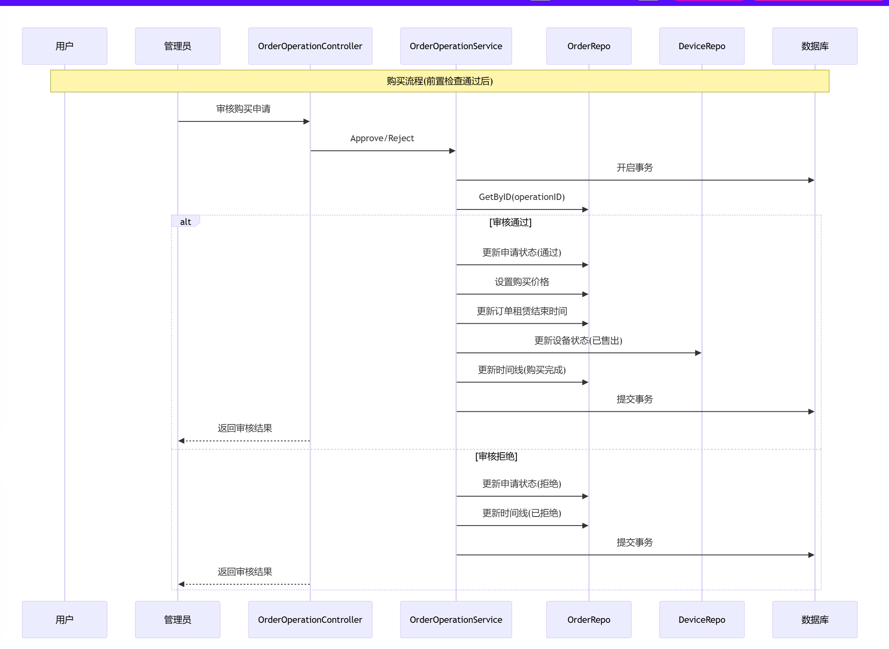

#### 订单操作流程

### 前置条件
1. 订单存在
   
2. 订单状态是租界中
   
3. 当前不存在等待审核的操作
   
4. 当前不存在正在允许的流程

### 1. 申请维修， 这个过程中需要填写维修价格和责任方

a. 首先是用户进行申请，等到管理员审核

b. 审核通过则等到取货，拒绝则填写理由，流程结束

c. 取货完成，状态变成运输中

d. 到达维修中心，状态变成维修中

e. 维修完成，运输给用户，状态变为运输中

f. 用户收到货，状态变为维修完成，对该设备的维修次数+1

g. 该操作流程结束

### 2. 申请保养 , 这个过程需要填写保养价格和责任方  
a. 首先是用户进行申请，等到管理员审核

b. 审核通过则等到取货，拒绝则填写理由，流程结束

c. 取货完成，状态变成运输中

d. 到达保养中心，状态变成保养中

e. 保养完成，运输给用户，状态变为运输中

f. 用户收到货，状态变为保养完成，对该设备的保养次数+1

g. 该操作流程结束

### 3. 申请归还

a. 首先是用户进行申请，等到管理员审核

b. 审核通过则等到取货，拒绝则填写理由，流程结束

c. 取货完成，状态变成运输中

d. 到达归还中心，状态变成验收中

e. 验收完成，状态变成归还完成, 需要更新订单的实际归还时间, 需要将设备的状态更新为空闲，需要将对应的设备类型的库存增加

f. 该操作流程结束

### 4. 申请续租

a. 首先是用户进行申请，等到管理员审核

b. 审核通过则直接根据续租时长计算金额，无需用户填写，拒绝则填写理由，流程结束

c. 续租完成，状态变成续租完成, 需要更新订单的租赁结束时间

d. 该操作流程结束

### 5. 申请购买

a. 首先是用户进行申请，等到管理员审核

b. 审核通过则需要填写购买价格，拒绝则填写理由，流程结束

c. 购买完成，状态变成购买完成, 需要更新订单的租赁结束时间, 需要将设备的状态更新为已售出

d. 该操作流程结束

